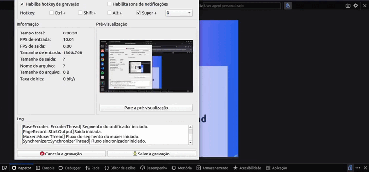

# Alura NewsLetter

Desenvolvimento de uma aplicação frontend com HTML/CSS/Tailwind. Desenvolvendo aplicações com o ambiente de desenvolvimento Tailwind, onde o principal objetivo foi aplicar conhecidos aplicados das classes desenvolvidas na ferramenta.



## Funcionalidades

- Teste de Tailwind
- Ambiente para enviar email do usuário (estático)

## Como utilizar

```bash
# Terminal

git clone https://github.com/MateusMaciel340/alura-spa # clone do repositório

cd aluracast/ # acessando pasta

# index.html ou newsletter (a verdadeira aplicação é o newsletter)

# acessar Live Server com index.html
```

## Contribuição

Contribuições são bem-vindas! Se você quiser contribuir com este projeto, por favor, abra uma issue para discutir suas ideias ou envie um pull request com suas alterações.

**Desenvolvedor:** Mateus Maciel - @mateusdev340

## Tecnologias:

- HTML
- CSS
- Tailwind

## Licença

Este projeto é licenciado sob a licença Alura Cursos.